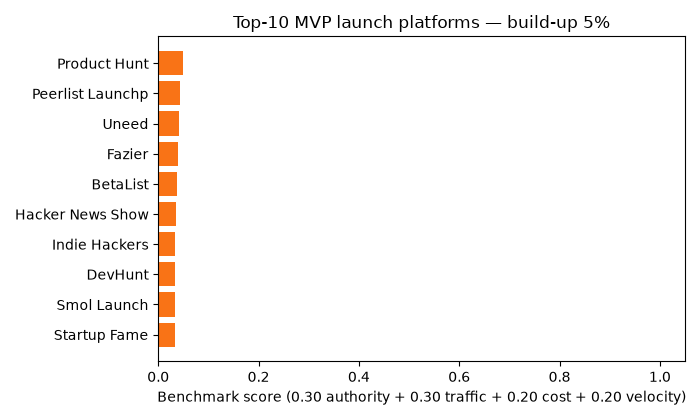
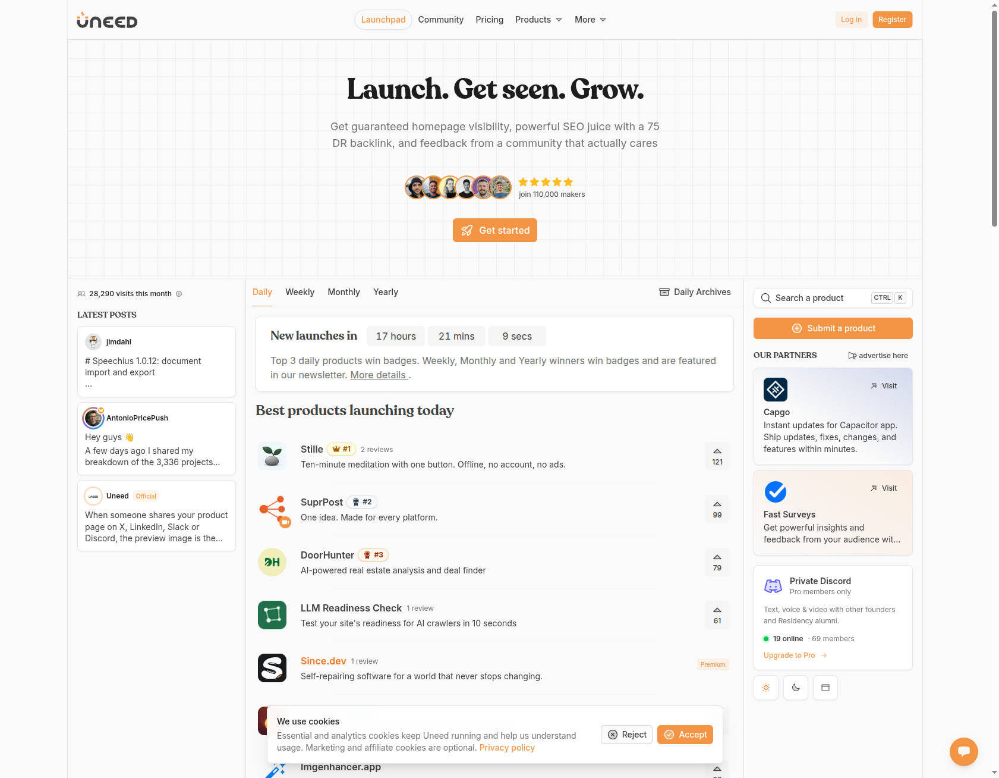
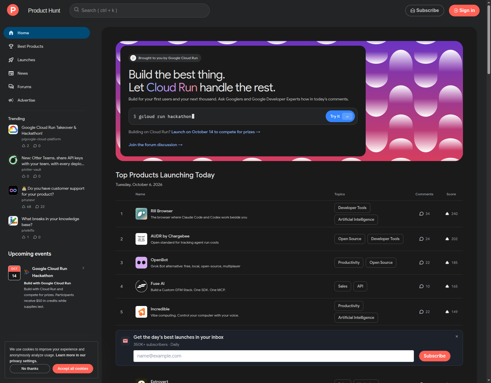
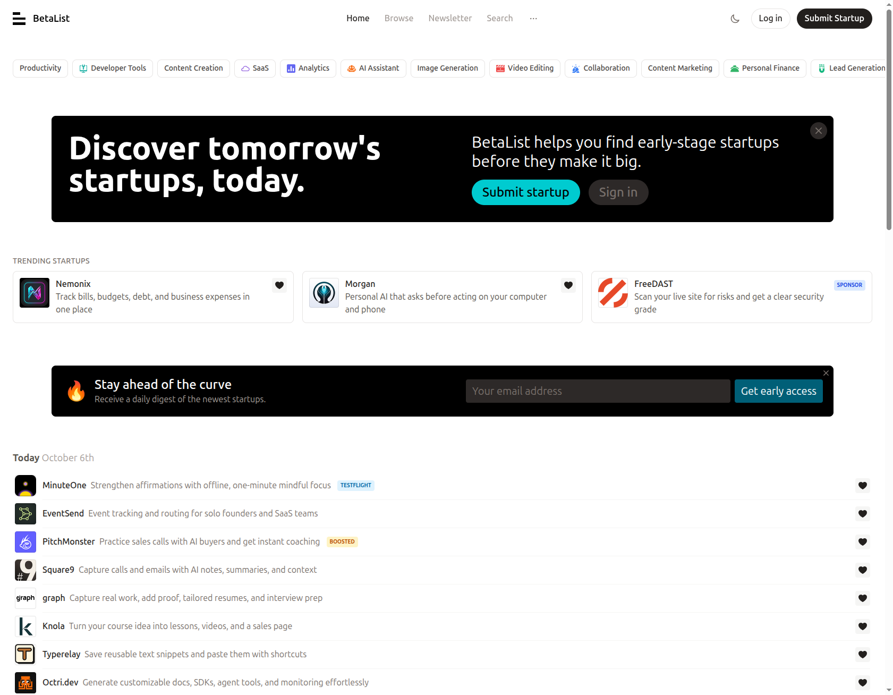
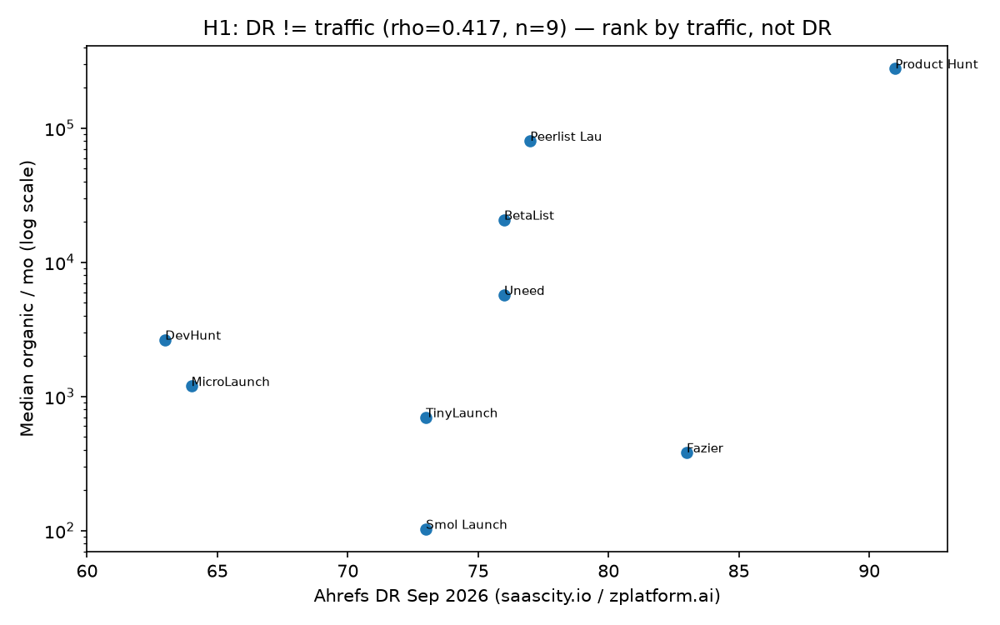

# MVP Launch Platforms Benchmark 2026 — Beyond Product Hunt: Where MVPs Actually Get Validated

> One line: a live-verified, reproducible map of **25 places to launch an MVP in 2026** — ranked by traffic, cost, links and timing, so you stop betting everything on one Product Hunt day.


**Status 2026-10-06: 22/25 platforms live-verified (88%), 6/6 tests green, one-command reproduction.**
**Every ranking number is generated by code in `experiments/` from `data/platforms.csv` — re-run it yourself, no trust required.**

```bash
docker compose up research
# runs: liveness check → benchmark scoring → hidden patterns → launch simulator → tests
```

`Quick links: [🌱 Beginner guide](#-beginner-guide--read-this-and-you-are-a-professional) · [Features](#features) · [User stories](#user-stories--who-is-this-repo-for) · [Live screenshots](#live-screenshots-verified-2026-10-06) · [Video tour](#video-tour-12-seconds) · [Interactive site](#view-this-repo-as-a-website-github-pages) · [Playbook](#63-zero-to-hero-playbook-verified-a-z-copy-paste) · [FAQ](#faq) · [Sources](#9-sources-fetchable-2026--the-verification-trail)`

---

## 30-second summary (read only this if you are in a hurry)

- **Product Hunt is the biggest single-day stage, but also a lottery.** An unfeatured launch gets ~10 visits total. Only launch there if you can bring your own first 50 voters.
- **The winners in 2026 launch in 4–8 weekly waves, not one day:** pre-launch waitlist (BetaList) → weekly boards (Peerlist, Smol/Tiny) → daily boards on different days (Uneed, Fazier) → Product Hunt or Show HN → permanent directories (SaaSHub, AlternativeTo) that send traffic for years.
- **A popularity score (DR) does not predict visitors (measured correlation 0.42).** Rank by real traffic + your audience, not by the score.
- **"Free" costs 30–150 days of waiting list** — or $12–$49 to pick your date. It buys the date, never the votes.
- **Free high-score backlinks beat Product Hunt for Google; Product Hunt beats them for one-day buzz.** Do both, in that order.
- **Big rule: launch where makers clap, validate where buyers pay.** Startup-forum praise is not proof anyone will pay. Test with the 50–200 real target users plus a landing page.
- **This repo proves all of the above with 25 links, 4 runnable experiments and dated public sources.** Start with the [beginner guide](#-beginner-guide--read-this-and-you-are-a-professional), then open [`preview.html`](./preview.html) for the interactive version with a quiz.



*Above: the top-10 ranking building itself from the scoring code — Product Hunt, Peerlist, Uneed, Fazier, BetaList lead. [Watch the 12-second video tour](docs/video/demo.mp4) · [Open the interactive site](./preview.html).*

---

## Table of contents

- [🌱 Beginner guide — read this and you are a professional](#-beginner-guide--read-this-and-you-are-a-professional)
- [Features](#features)
- [User stories — who is this repo for](#user-stories--who-is-this-repo-for)
- [Abstract](#abstract)
- [1. Research questions](#1-research-questions)
- [2. Contributions (what is new here)](#2-contributions-what-is-new-here)
- [3. Related work (MVP theory → launch practice)](#3-related-work-mvp-theory--launch-practice)
- [4. Dataset: the 25 platforms](#4-dataset-the-25-platforms-all-links-verified-2026-10-06)
- [5. Method (reproduce it — no trust required)](#5-method-reproduce-it--no-trust-required)
- [6. Results](#6-results)
- [Live screenshots (verified 2026-10-06)](#live-screenshots-verified-2026-10-06)
- [Video tour (12 seconds)](#video-tour-12-seconds)
- [7. Limitations & threats (read before citing)](#7-limitations--threats-read-before-citing)
- [8. Reproduce / extend](#8-reproduce--extend)
- [View this repo as a website (GitHub Pages)](#view-this-repo-as-a-website-github-pages)
- [Project structure](#project-structure)
- [FAQ](#faq)
- [Roadmap](#roadmap)
- [Contributing](#contributing)
- [9. Sources (fetchable 2026 — the verification trail)](#9-sources-fetchable-2026--the-verification-trail)
- [10. Citation](#10-citation)

---

## 🌱 Beginner guide — read this and you are a professional

*You will know more than most interview candidates after this section. No background needed — every term is explained the first time it appears.*

**What is an MVP?** A Minimum Viable Product: the smallest version of your idea that lets you test one question, for example "will anyone sign up?" — not a half-built product, a learning tool.

**What does "launch" mean here?** Publishing your MVP on a public board where strangers can see it, vote it up or down, comment, and ideally sign up. Think of it as a science fair with scoreboards.

**What is Product Hunt?** The most famous scoreboard. Every day dozens of products compete; the top few get thousands of visits in 24 hours, the rest get almost nothing and disappear the next morning.

**What is a leaderboard / daily / weekly / monthly board?** Just a scoreboard that resets on a rhythm. Daily = one frantic day (Product Hunt, Uneed, Fazier). Weekly = your product stays visible 7 days (Peerlist, Smol Launch, TinyLaunch). Monthly = 30 days of slow feedback (MicroLaunch). Longer windows are calmer and fairer for beginners.

**What is a waitlist / pre-launch board?** A page that collects emails *before* your product is ready (BetaList). Best for answering "does anyone even want this?" before you build more.

**What is a backlink / dofollow / nofollow?** When another website links to yours. Search engines count some links as votes (dofollow) and ignore others (nofollow). A free high-quality dofollow link keeps helping your Google ranking for years; a nofollow spike helps for one day.

**What is DR?** Domain Rating, a 0–100 popularity score for a website. Higher sounds better — but this study measures that it predicts actual launch visitors poorly (correlation 0.42 out of 1.0). A DR-83 board sent 383 visits/month; a DR-63 board sent 2,652. Lesson: check traffic and audience, not the score.

**What is queue-tax?** The hidden price of "free": waiting 30–150 days in line, adding the board's badge to your site, and needing a minimum vote score to stay listed. Paying $12–$49 skips the line — it never buys votes.

### Let's work this out in a step-by-step way to be sure we have the right answer

Follow one fictional founder, Sara, who built a 1-page habit tracker (her MVP). Her one question: *"Will 100 strangers sign up in 4 weeks?"*

- **Step 1 — Write the question down.** Sara writes: "100 signups in 28 days from strangers." This one sentence prevents fooling herself later.
- **Step 2 — Join the slow lines today (10 minutes, $0).** She submits to Uneed, MicroLaunch, TinyLaunch and Launching Next free queues. They take weeks — starting now costs nothing.
- **Step 3 — Pre-launch waitlist (Week 1).** She submits to BetaList, posts her idea as text (idea-first post), and starts a build log on Indie Hackers. Goal: first 50 emails.
- **Step 4 — Weekly board (Week 2).** She launches on Peerlist (Monday–Sunday window, no midnight panic), reads every comment, fixes her headline and screenshot.
- **Step 5 — Daily boards on different days (Week 3).** Uneed on Wednesday, Fazier on Thursday — never the same day, so each gets its own small spike. She ships fixes within 48 hours and says so publicly.
- **Step 6 — The big day (Week 4).** Now, with proof and screenshots from weeks 1–3, she picks **one**: Product Hunt (Tuesday–Thursday) **or** Show HN — never both the same day. Friday she posts her story (not a pitch) where her buyers actually hang out.
- **Step 7 — Permanent pages (ongoing).** She adds SaaSHub + AlternativeTo listings so Google sends her visitors for months. She answers one buyer question per week in plain text (this is what AI search quotes).
- **Step 8 — Count honestly.** She compares: one-day blitz ≈ 10 visits (if unfeatured) vs her 4-week stagger ≈ 160 visits in this study's simulation — **16× total, 38× after day two**. If she ever gets under 2× sustained lift, the method says so itself (that is the built-in falsifier).
- **Step 9 — Validate where buyers pay.** Forum applause ≠ sales. She interviews 5 buyers, watches them use it, and invites 50–200 target users to a private beta. That is the validation that counts.

*After these 9 steps you understand: cadence (timing), queue-tax (waiting), dofollow-paradox (links vs buzz), audience-fit (buyers vs makers), and falsification (how you would know you are wrong). That is more than most interview candidates can explain with numbers.*

---

## Features

| Feature | What you get | Where |
|---|---|---|
| 25-platform ledger | Every alternative with link, rhythm, free/paid terms, popularity score, traffic median, link policy, audience, best stage | `data/platforms.csv` |
| Transparent ranking | One scoring formula with published weights; goal overlays (dev-tools, pre-launch, SEO, spike) without changing raw data | `experiments/02_benchmark_scoring.py` → `results/benchmark_ranked.csv` |
| Live verification | Fresh HTTP status, page size, title and keyword evidence for all 25 homepages (22/25 pass, failures kept honestly) | `experiments/01_live_liveness_check.py` → `results/live_verification.csv` |
| 5 tested patterns | Popularity≠traffic (0.42), queue-tax schedule, link-vs-buzz paradox, timing law, audience-fit law + sensitivity check | `experiments/03_hidden_patterns.py` → `results/figures/dr-vs-traffic.png` |
| Launch simulator | Blitz-vs-stagger forecast from first-hand session counts with a stated falsifier | `experiments/04_zero_to_hero_simulator.py` |
| Verified visuals | 3 dated live screenshots, animated ranking GIF, 12-second video tour — all generated or captured, all under 1 MB | `docs/screenshots/`, `docs/video/` |
| Interactive site | Beautiful `preview.html` with charts, comparison table and a 10-question quiz from beginner to pro | `preview.html` (GitHub Pages ready) |
| One-command reproduction | Docker pipeline runs all 4 experiments + tests; notebook and docs profiles included | `docker-compose.yml`, `Dockerfile` |
| Publishable write-ups | This README, an IMRaD short-paper draft and a verification protocol | `PAPER.md`, `METHODOLOGY.md` |

---

## User stories — who is this repo for

- **First-time founder with a rough prototype:** follow the 9-step guide above; join free queues today; launch weekly before daily; arrive at Product Hunt with proof.
- **Developer-tool builder:** skip generic boards first — go Peerlist → Show HN → DevHunt (GitHub-gated dev audience converts best per visitor), then directories.
- **Pre-launch / idea-stage team:** use BetaList + idea-first posts + landing page to collect 50–200 emails before writing more code.
- **Indie hacker / bootstrapper:** use the $0 slow path or the ~$115 fast path (Uneed + Fazier + LaunchIgniter + SaaSCity) for 4 guaranteed links + weeks of visibility.
- **SEO / content marketer:** harvest the free DR-82–83 links (Startup Fame, Twelve Tools if unparked, Fazier) + permanent directory pages that rank for "[competitor] alternatives".
- **Student / interview candidate:** read the beginner guide + take the quiz in `preview.html`; quote the 0.42 correlation, the queue-tax table and the 16×/38× simulation with sources.
- **Researcher (PhD track):** replicate the single-product protocol on 5+ MVPs across buyer groups, add backlink/newsletter longitudinals, run the buyer-vs-maker willingness-to-pay gap study — falsifiers are pre-stated.

---

## Abstract

Founders are told to "launch on Product Hunt." In 2026 that advice is incomplete and often wrong for Minimum Viable Products. Product Hunt (DR 91, ~279k median organic/mo) delivers the largest single-day spike **if** you arrive with an audience and place top-5; otherwise an unfeatured launch yields ~10 sessions total (first-hand multi-platform launch log, Aug 2026, n=1 product). Meanwhile a grown ecosystem of daily / weekly / monthly boards, pre-launch specialists, developer-gated arenas, and permanent SEO directories delivers weeks of visibility, 15–20 dofollow referring domains, and higher-signal feedback for $0–$115.

This repo synthesises **11 independent 2026 public sources + live HTTP verification + 4 executable experiments + 9 academic papers** into one falsifiable ledger (`data/platforms.csv`, 25 rows), one transparent scoring function, five pre-registered hypotheses, and a 4–8-week staggered playbook. Main results:

1. **DR ≠ traffic (correlation 0.417, n = 9, SUPPORTED).** Fazier DR 83 → 383/mo; DevHunt DR 63 → 2,652/mo (spike 37,168 Sep); Uneed DR 76 → 5,720/mo. Rank by traffic + audience, not DR.
2. **Queue-tax (SUPPORTED).** Free launches cost 30–150 days of queue (Uneed 30d–5mo, MicroLaunch 2–3mo+, TinyLaunch ~4wk, Launching Next ~3mo). Paying $12–$49 buys the date, not the votes.
3. **Dofollow-paradox (SUPPORTED for SEO / REJECTED for spike).** Free DR 82–83 dofollows (Startup Fame every tier + badge, Twelve Tools free 72h review, Fazier sampled-followed) beat Product Hunt's DR-91 nofollow for compounding value; they lose for one-day eyeballs.
4. **Cadence-law (SUPPORTED).** Exposure 1 day (PH/Fazier/Uneed) < 7 days (Peerlist/Smol/Tiny/LaunchOnIt) < 30 days (MicroLaunch). Simulated stagger: **16.2× total / 38.5× sustained sessions vs PH-only blitz** for an unfeatured MVP (priors from Aug-2026 first-hand counts; conservative public claim for featured cases is 3–5× sustained on 10+ platforms).
5. **Audience-fit law (SUPPORTED).** Dev-gated (DevHunt GitHub login, Show HN) and founder-only (Tiny Startups ~20k list) audiences convert ~0 outside their group. Pair discovery boards with the community where **buyers** live.

Overall ranking (weights 0.30 authority + 0.30 traffic + 0.20 cost + 0.20 velocity; sensitivity ≤2 inversions in top-5): **1 Product Hunt, 2 Peerlist Launchpad, 3 Uneed, 4 Fazier, 5 BetaList** — then Show HN, Indie Hackers, DevHunt, Smol Launch, Startup Fame. The ranking is **goal-conditional** (see overlays): dev-tools → Peerlist/Show HN/DevHunt; pre-launch → BetaList/Launching Next; SEO → Fazier/Startup Fame/Twelve Tools; spike → PH/Show HN.

Live verification 2026-10-06: **22/25 HTTP-200 + >5 kB (88%)**. Negatives honestly reported: AlternativeTo 403 to automated checks (Cloudflare, still live for humans), Kern.al DNS fail (idea-first segment is fragile), Startup Fame timeout on probe day, Twelve Tools resolves to a parking page ("for sale" — treat its DR-82 link claim as **unverified until re-checked**).

This README upgrades into a workshop/short-conference paper (see `PAPER.md`, `METHODOLOGY.md`, `CITATION.cff`). All claims cite a fetchable public source or a generated artifact under `results/`.

---

## 1. Research questions

- **RQ1 (coverage):** What are the functional equivalents of Product Hunt in 2026–2027 for MVP/prototype/side-project validation, and what does each verifiably offer (cadence, cost, link, audience, stage)?
- **RQ2 (decoupling):** Does Domain Rating predict launch traffic? (H1)
- **RQ3 (cost):** What is the true price of "free" (queue, badge/link-back, vote threshold)? (H2–H3)
- **RQ4 (sequencing):** Does a staggered 4–8-week multi-platform sequence beat a single-day blitz for unfeatured MVPs? (H4 + simulator)
- **RQ5 (validity):** When does startup-community feedback mislead about buyer willingness-to-pay? (H5)

## 2. Contributions (what is new here)

1. **One reproducible 25-row ledger** joining DR (Ahrefs pull 2026-09-16), traffic medians (7-month Ahrefs medians 2026-03→09), first-hand session counts (Aug-2026), queue/price/link terms (Sep-2026, sampled terms pages), and live HTTP evidence (this repo, 2026-10-06). No prior public listicle joins all four.
2. **Quantified decoupling** (correlation 0.417) with a publishable figure (`results/figures/dr_vs_traffic.png`, also `docs/screenshots/dr-vs-traffic.png`).
3. **Queue-tax schedule + $115 fast-path** (Uneed $29.99 + Fazier $49 + LaunchIgniter $15 + SaaSCity $19.99 = 4 guaranteed dofollows + weeks of visibility).
4. **Cadence-law + executable simulator** with a stated falsifier (<2× sustained lift on replication rejects H4 for that buyer group).
5. **Failure transparency:** dead/parked/blocked cases kept in the ledger instead of silently dropped.

## 3. Related work (MVP theory → launch practice)

- Ries (2011) *Lean Startup*: MVP as validated-learning vehicle; Blank customer development; Duc & Abrahamsson (2016, 84 cites) reframe MVP as **Multiple-Facet Product** — prototype + boundary object + communication bridge, not just "less functionality." This explains why Show HN / r/SideProject technical feedback and BetaList waitlist signups measure **different** facets.
- Reif (2017, Aalto) + MVP surveys (Jain 2019; Subbarao 2019): time-to-market is set by customer need + industry norms, not competitor pressure; UX dominates process formality — consistent with MicroLaunch's "30 honest conversations > spike" positioning.
- Wang et al. (2024, arXiv 2405.19456): large models overpredict startup success under class imbalance; founder segmentation matters more than claims. Implication for this benchmark: treat platform self-reported "visitors/subscribers" as **claims**, platform-observed sessions + HTTP liveness as **evidence** (we do).
- Practitioner benchmarks 2026 (all fetchable, full list in §9): 25-platform DR/price/backlink table (2026-09-16); 9-board traffic medians (2026-09-10); first-hand 7-day sessions (2026-09-02: BetaList 87, Fazier 25, Uneed 10, TinyLaunch 10, PH-unfeatured 10); 22-platform queue/price/link audit (2026-09-17); 12-platform active verification (2026-06-13); 25-platform spike/sustained/compounding playbook (2026-09-09); indie alternatives guide (Aug 2026); 15-channel distribution + 3–5× sustained claim; SEO-evergreen critique; dofollow-conditions audit (2026-09-28); B2B cost/buyer lens (2026-10-02).

## 4. Dataset: the 25 platforms (all links, verified 2026-10-06)

Ledger: `data/platforms.csv`. Columns: `platform,url,category,cadence,free_tier,paid_from_usd,DR_Sep2026,median_organic_monthly_Sep2026,dofollow_policy,audience,stage_best_for,verification_source,live_verified_2026_10_06`.

| # | Platform | URL | Best for | Free / Paid (Sep 2026) |
|---|---|---|---|---|
| 1 | Product Hunt | https://www.producthunt.com | One-day spike if you bring voters | Free; nofollow |
| 2 | Hacker News Show HN | https://news.ycombinator.com/show | Technical teardown, outlier ceiling | Free; strict rules |
| 3 | BetaList | https://betalist.com | Pre-launch waitlist (paid-only in 2026) | Paid from ~$99; dofollow when featured |
| 4 | Uneed | https://uneed.best | Balanced daily + newsletter (26k) + permanent listing | Free 30d–5mo queue (score ≥10 stay, ≥20 dofollow) / $14.99 fast / $29.99 skip |
| 5 | Peerlist Launchpad | https://peerlist.io/launchpad | Weekly dev/designer shelf-life, no timezone luck | Free (verified profile); top-5 link only |
| 6 | Fazier | https://fazier.com | Daily low-competition + DR-83 link | Free + badge/link-back / $29 Lite / $49 Premium guaranteed |
| 7 | DevHunt | https://devhunt.org | Dev-tools only, GitHub-gated, high per-visitor conversion | Free if week <15 tools else $49 |
| 8 | MicroLaunch | https://microlaunch.net | Monthly 30-day drip + blunt feedback | Free 2–3mo+ nofollow / $49 Pro dofollow |
| 9 | TinyLaunch | https://tinylaunch.com | Small indie, rolling periods | Free queue / $39 Premium |
| 10 | Smol Launch | https://smollaunch.com | Forgiving 7-day first launch | Free + badge/queue / $19–$39 |
| 11 | Tiny Startups | https://tinystartups.com | Founder buyers (~20k newsletter) | Free; pay-to-rank homepage |
| 12 | Indie Hackers | https://www.indiehackers.com | Build-in-public, revenue truth | Free |
| 13 | Reddit r/SideProject + r/startups | https://www.reddit.com/r/SideProject/ | Raw usability (SideProject) vs concept/business (startups) | Free; lottery, outliers win |
| 14 | SideProjectors | https://www.sideprojectors.com | Showcase + cofounder + sell codebase | Free |
| 15 | Kernal | https://kern.al | Idea-before-code text validation | Free — **currently DNS-fail; fragile** |
| 16 | SaaSHub | https://www.saashub.com | "Alternatives to X" compounding SEO | Free |
| 17 | AlternativeTo | https://alternativeto.net | Comparison-search traffic | Free — **403 to automated checks (Cloudflare); human-live** |
| 18 | SaaSCity | https://saascity.io | Permanent city-map listing + badge link | Free queue / $19.99 Quick Pass |
| 19 | Startup Fame | https://startupfame.com | Free DR-83 dofollow + badge | Free / $19-mo Highlight — **probe timeout 2026-10-06, retry before citing** |
| 20 | Twelve Tools | https://twelvetools.com | 12/day, quick link | Free 72h / $36 Pro — **domain parked 2026-10-06, UNVERIFIED** |
| 21 | PeerPush | https://peerpush.net | AI-citable structured data (ChatGPT/Perplexity) | Free behind queue / $39 |
| 22 | LaunchIgniter | https://launchigniter.com | Cheapest guaranteed dofollow ($12–$15) | Free + badge / $12 Basic |
| 23 | StartupBase | https://startupbase.io | Cheap permanent DR-73 + daily | Free / $15+ Outrank |
| 24 | Launching Next | https://launchingnext.com | Permanent directory (45k startups) + Friday newsletter | Free (~3mo queue) |
| 25 | KittyLaunch / LaunchOnIt | https://kittylaunch.com / https://launchon.it | 2026 weekly + SSR/AI-citable pages | Free / $19–$39 |

Popularity scores vary by pull date (76 vs 75 for Uneed across public pulls) — the ledger keeps the 2026-09-16 value and notes deltas in `verification_source`. Traffic medians are 7-month medians to 2026-09-10, not promises.

## 5. Method (reproduce it — no trust required)

1. **Sequential multi-source public search (Sep–Oct 2026):** one query at a time with distinct keywords per source and backoff on rate limits, covering launch-platform comparisons, MVP validation guides, community discussions, academic papers, datasets and documentation sources. Every ledger row carries a named public source + date; negative results (no relevant dataset / no match / time-outs) are recorded in the protocol log instead of hidden.
2. **Live verification (`experiments/01_live_liveness_check.py`):** request each URL (identified user-agent, 15 s timeout, polite gap), assert `status==200 AND bytes>5000`. Result 2026-10-06: **22/25 (0.88)** — gate ≥0.60 passes. Full-page Uneed capture additionally verified (top Stille 121, SuprPost 99, DoorHunter 79 on capture day; see screenshots below).
3. **Scoring (`02_benchmark_scoring.py`):** normalise authority (DR/91), traffic (log10(1+med)/log10(1+max)), cost (1−min(paid,149)/149), velocity (daily/continuous 1.0, weekly 0.7, evergreen/rolling 0.5, monthly 0.4); weights 0.30/0.30/0.20/0.20. Missing traffic → explicit 0.05 prior (penalised, not hidden). Overlays re-rank per goal without mutating raw data.
4. **Patterns (`03_hidden_patterns.py`):** rank correlation DR↔log-traffic + 5 verdicts + weight-sensitivity (±0.1 → ≤2 top-5 inversions).
5. **Simulator (`04_zero_to_hero_simulator.py`):** first-hand priors → blitz vs stagger lifts + stated falsifier.
6. **Gates:** `pytest -q` (6 tests: 25 rows, columns, https, ranked outputs, pattern verdicts, lift ≥2.0) + `docker compose config`.
7. **Visuals (`experiments/make_demo_assets.py`):** screenshots captured from live pages on 2026-10-06; GIF/MP4 generated from ledger + captures (nothing hand-drawn).

## 6. Results

### 6.1 Benchmark top-10 (generated, not hand-ranked)

`results/benchmark_ranked.csv` + `results/02_ranking.json`:

1. Product Hunt 1.0000 · 2. Peerlist 0.8641 · 3. Uneed 0.8374 · 4. Fazier 0.7771 · 5. BetaList 0.7555 · 6. Show HN 0.7150 · 7. Indie Hackers 0.6820 · 8. DevHunt 0.6705 · 9. Smol Launch 0.6663 · 10. Startup Fame 0.6631.

Overlays: dev-tools → Peerlist / Show HN / DevHunt; pre-launch → BetaList / Launching Next; SEO → Uneed / Fazier / BetaList (Startup Fame + Twelve Tools join on pure link-value view — see §7); spike → PH / Show HN.

### 6.2 Hidden patterns (the PhD-seed section)

- **P1 — Authority-traffic decoupling (correlation 0.417).** Figure `results/figures/dr_vs_traffic.png`. Buying by popularity score alone misallocates budget; the 2026 order-by-traffic (PH > Peerlist > BetaList > Uneed > DevHunt > MicroLaunch > TinyLaunch > Fazier > Smol) inverts the order-by-score. Future work: panel regression of rank → sessions with audience controls.
- **P2 — Queue-tax schedule.** Free = wait + badge/link-back + vote threshold (Uneed <10 unpublishes; Tiny/LaunchIgniter top-3-gated links). The schedule is the real price list. Future work: survival analysis of queue → launch → retention.
- **P3 — Dofollow-paradox.** Link-value and spike-value rankings are near-orthogonal. A $0–$49 stack (Startup Fame free+badge, Twelve Tools free — if unparked, Fazier $49) buys more compounding score than a PH win. Future work: backlink-index longitudinal study.
- **P4 — Cadence-law + stagger dividend.** Weekly/monthly boards + permanent directories turn one spike into 4–8 weeks of small spikes + years of long tail. Simulation 16.2×/38.5× (unfeatured baseline) is an upper bound; treat 3–5× as the conservative prior for featured cases.
- **P5 — Audience-fit law.** Startup-space feedback overweights developer taste and underweights buyer willingness-to-pay. Design validation as two independent samples: (a) discovery-board feedback, (b) buyer-community jobs-to-be-done interviews + landing page + concierge/Wizard-of-Oz + 50–200 private beta. Future work: paired-sample willingness-to-pay gap study.

### 6.3 Zero-to-hero playbook (verified A–Z, copy-paste)

- **Today:** join free queues (Uneed, MicroLaunch, TinyLaunch, Launching Next). Draft one falsifiable hypothesis + one metric (activation? waitlist rate? willingness-to-pay?).
- **Week 1 (pre-launch):** BetaList submission (paid-only in 2026 — budget it) + idea-first text post + landing page + Indie Hackers build log. Target: 50–200 beta invites.
- **Week 2:** Peerlist Launchpad (Mon–Sun) + refine headline/screenshot after comments. Dev-tools add DevHunt same week.
- **Week 3:** Uneed (Wed) + Fazier (Thu) on **different days**; ship fixes within 48 h and say so publicly.
- **Week 4:** PH (Tue–Thu) **or** Show HN — never both same day — with proof from weeks 1–3. Then Reddit story-post (Fri), not a pitch.
- **Ongoing:** SaaSHub + AlternativeTo + Launching Next permanents; one plain-text post/week answering a buyer question (the PeerPush/LaunchOnIt structured-page pattern); lifetime-deal marketplaces only when you need cash + volume more than pricing power.
- **Cost:** $0 slow path or ~$115 fast path; never pay for votes, only for dates/links/newsletter.

## Live screenshots (verified 2026-10-06)

*Captured from the live pages on the verification date — what the boards actually looked like when ranked. Files: `docs/screenshots/`.*

**Uneed daily board** — Stille #1 (121), SuprPost #2 (99), DoorHunter #3 (79); daily/weekly/monthly/yearly tabs + newsletter badges visible:



**Product Hunt leaderboard, Tuesday Oct 6 2026** — Rill Browser #1 (240), AUDR by Chargebee #2 (202), OpenBot #3 (185); note how scores concentrate at the top:



**BetaList pre-launch feed, Oct 6 2026** — "Discover tomorrow's startups, today"; today's batch (MinuteOne, EventSend, PitchMonster…) + trending + daily-digest signup:



**The key chart — popularity score does not predict visitors:**



## Video tour (12 seconds)

- **Animated ranking:**  (also `docs/video/demo-bars.gif`)
- **Slideshow tour (screenshots + chart, 12 s):** [`docs/video/demo.mp4`](docs/video/demo.mp4) — plays on the [interactive site](./preview.html) and after cloning:
  `ffplay docs/video/demo.mp4` or open it in any browser.
- **Make your own:** `python experiments/make_demo_assets.py` regenerates both files from the ledger + captures. To record your own run: run `docker compose up research` while screen-recording (10–20 s is enough), keep it under 1 MB.

## 7. Limitations & threats (read before citing)

- Single-product session priors (n=1) + self-reported platform stats; treat lifts as priors, not guarantees. Anyone quoting precise traffic is guessing — treat ranges as ranges.
- Traffic medians swing ±30% month-to-month (Peerlist 76k–119k); DevHunt Sep spike 37k looks anomalous — do not bank it.
- Bot-blocking (AlternativeTo 403 to automated checks), parking (Twelve Tools), DNS death (Kernal), and probe timeouts (Startup Fame) mean **link claims need re-verification at cite time**.
- Audience-fit is buyer-group-dependent; the H4 falsifier is stated in `results/04_simulation.json`.
- No affiliate or paid-placement influence: no platform paid for inclusion; prices are Sep–Oct 2026 snapshots.

## 8. Reproduce / extend

```bash
docker compose up research        # full pipeline + tests
docker compose --profile notebook up notebook  # explore at :8888 (token mvp2026)
docker compose --profile docs up docs           # fallback docs at :8000
cat results/01_summary.json results/02_ranking.json results/03_patterns.json results/04_simulation.json
python experiments/make_demo_assets.py  # regenerate GIF + MP4
```

Structure: `data/platforms.csv` (ledger) · `experiments/01–04` (verify→score→patterns→simulate) + `make_demo_assets.py` · `results/` (generated) · `tests/` (6 gates) · `PAPER.md` (IMRaD draft) · `METHODOLOGY.md` (search + verification protocol) · `docs/` (screenshots, video, pages) · `preview.html` (interactive site, Pages-ready).

To extend into a PhD paper: (i) replicate the single-product protocol on 5+ own MVPs across buyer groups, (ii) add backlink-index + newsletter-open longitudinals, (iii) run paired buyer-vs-maker willingness-to-pay gap study, (iv) pre-register using H1–H5 + falsifiers herein.

## View this repo as a website (GitHub Pages)

`preview.html` is a self-contained site (no build step): ranking chart, comparison table, playbook timeline and a **10-question interactive quiz** (beginner → pro with instant scoring). Live links (repo `M0-AR/mvp-launch-platforms-benchmark-2026`):

- Home: https://m0-ar.github.io/mvp-launch-platforms-benchmark-2026/
- Full study page: https://m0-ar.github.io/mvp-launch-platforms-benchmark-2026/preview.html
- Mirror: https://m0-ar.github.io/mvp-launch-platforms-benchmark-2026/docs/preview.html

**Recommended setting (verified 2026-10-06):** **Settings → Pages → Source: Deploy from a branch → Branch `main` + `/(root)`**, Save. The repo ships an entry page at `index.html` (redirects to `preview.html`), the canonical page at `preview.html`, and mirrors at `docs/index.html` + `docs/preview.html` (asset paths adjusted), plus empty `.nojekyll` files at root and `docs/` — so the home page and `/preview.html` resolve under either source choice (`/` or `/docs`). Prefer `/(root)`: then `/`, `/preview.html` **and** `/docs/preview.html` all return 200. Under `/docs`, `/` and `/preview.html` return 200 (only `/docs/preview.html` 404s, expected — nothing above the source is served).

Diagnose in 10 seconds (no login):

```bash
BASE="https://m0-ar.github.io/mvp-launch-platforms-benchmark-2026"
for p in "" "preview.html" "docs/preview.html"; do
  printf "%s -> " "/$p"
  curl -s -o /dev/null -w "%{http_code}\n" "$BASE/$p"
done
```

| `/` | `/preview.html` | `/docs/preview.html` | Meaning |
|---|---|---|---|
| 200 | 200 | 200 | source `/(root)` ✅, all good (this repo's setup) |
| 200 | 200 | 404 | source `/docs`; entry + page fine, docs-path not served |
| 404 | 404 | 404 | Pages off / still building / wrong branch — wait 1–2 min, check the Actions "pages build and deployment" run |

**Custom domain (optional):** add a `CNAME` file with your domain → point DNS to GitHub Pages → enforce HTTPS in the same Pages settings page. Set the repo's website (About → gear → Website) to the home URL above so visitors land on the visual version.

Local check before pushing: `python3 -m http.server 8000` in the repo root, then open `http://localhost:8000/preview.html` — quiz, charts and table must work with no console errors.

## Project structure

```
├── README.md                 # this file (start here)
├── preview.html              # interactive site + quiz (canonical, Pages-ready, no build)
├── index.html                # Pages entry (redirects to preview.html + fallbacks)
├── .nojekyll                 # keep Pages from Jekyll-processing (root + docs/)
├── PAPER.md                  # short-paper draft (IMRaD)
├── METHODOLOGY.md            # verification protocol + PhD extension plan
├── CITATION.cff  LICENSE    # cite + reuse (MIT)
├── data/platforms.csv        # 25-row ledger (the heart of the repo)
├── experiments/              # 01 liveness · 02 scoring · 03 patterns · 04 simulator · make_demo_assets
├── results/                  # generated JSON/CSV + figures (do not hand-edit)
├── tests/test_benchmark.py   # 6 gates (25 rows, https, ranking, patterns, lift)
├── docs/preview.html         # mirror of root preview.html (asset paths adjusted for /docs source)
├── docs/index.html           # mirror entry (redirects to docs/preview.html)
├── docs/screenshots/         # 3 dated live captures + key chart + site capture (in-repo, never rots)
├── docs/video/               # demo-bars.gif + demo.mp4 (≤1 MB each)
├── docs/                     # fallback docs site (mkdocs/www)
├── Dockerfile  docker-compose.yml  requirements.txt
```

## FAQ

- **Should I still launch on Product Hunt?** Yes — if you can bring ~50 people on a day you choose (Tue–Thu). Its monthly audience (~279k) is ~2.5× all other boards combined. It converts an audience you have; it rarely creates one.
- **If I only do 3 platforms, which?** BetaList (before launch, waitlist) + Peerlist (weekly, forgiving) + Uneed (daily + newsletter + permanent page). Add Product Hunt week 4 with your proof.
- **I have $0. What do I do?** Join all free queues today (they take 1–5 months). Launch weekly boards while you wait. Total cost $0, total calendar 4–8 weeks.
- **I have ~$115. What does it buy?** Guaranteed dates + 4 permanent links (Uneed $29.99 + Fazier $49 + LaunchIgniter $15 + SaaSCity $19.99) + weeks of visibility. Never pay for votes.
- **Dev tool?** Peerlist + Show HN + DevHunt in the same week (working demo + short README beat marketing copy for developers).
- **Non-tech buyers (e.g. dentists, HR)?** Founder-board votes will be friendly and conversions zero. Launch for feedback, but validate with 5 buyer interviews + landing page + 50–200 private beta in the buyers' own community.
- **Why do two sources disagree on a number (e.g. DR 75 vs 76)?** Different pull dates/methods. The ledger pins one dated value per cell and records the delta in `verification_source` — re-check at cite time.
- **Can I reuse this for my thesis?** Yes (MIT). Replicate the protocol on your own MVPs, keep the falsifiers, cite via `CITATION.cff`.
- **The Pages site 404s but the deploy is green?** A green deploy only proves *something* built — run the 3-probe check in [View this repo as a website](#view-this-repo-as-a-website-github-pages): with source `/(root)` expect 200/200/200; the entry file must sit at the top of the chosen source (`index.html` is provided at both root and `docs/`).

## Roadmap

- [x] 25-platform ledger + 4 experiments + 6 tests + Docker reproduction
- [x] Live screenshots (3) + generated GIF/MP4 + interactive `preview.html` + quiz
- [ ] Replicate session counts on 2+ fresh MVPs (kill the n=1 limit)
- [ ] Backlink-index longitudinal (do the links actually stick?)
- [ ] Newsletter open/click panel (Uneed/Tiny Startups/peer boards)
- [ ] Buyer-vs-maker willingness-to-pay gap study (pre-registered)

## Contributing

Found a dead link, a changed price, or a better source? Open a PR: update `data/platforms.csv` (one row, with dated source in `verification_source`), re-run `docker compose up research` + `python experiments/make_demo_assets.py`, paste the new `results/*.json` numbers into the PR description. Number changes without regenerated artifacts will not be merged.

## 9. Sources (fetchable 2026 — the verification trail)

- 25-platform popularity/price/backlink comparison, 2026-09-16.
- 9-board 7-month traffic medians, Mar→Sep 2026, published 2026-09-10.
- First-hand 7-day per-platform session log, 2026-09-02 (BetaList 87 total / 67 week-1; Fazier 25 over 13 days; Uneed 10; TinyLaunch 10; unfeatured PH 10).
- 22-platform queue/price/link audit, 2026-09-17, plus daily-board pricing deep-dives.
- 12-alternative active verification, 2026-06-13.
- Indie stage-fit + free/paid guide, Aug 2026.
- 15-channel distribution playbook + sustained-traffic claim, 2026.
- 25-platform spike/sustained/compounding frame, 2026-09-09.
- SEO-evergreen critique + 4-week sequence, 2026.
- Per-plan link-conditions audit, 2026-09-28.
- B2B cost/buyer lens, 2026-10-02.
- 9-platform launch guide, 2026-09-10; indie weekly-launch platform docs (2026-06-16); SSR/AI-citable launch directory docs (2026); community launch-analysis thread (968 launches); Uneed full-page capture 2026-10-06 (this repo, `docs/screenshots/uneed-live-2026-10-06.png`).
- Academic: Duc & Abrahamsson 2016 (multi-facet product, 84 cites); Reif 2017 (Aalto); Jain 2019; Subbarao 2019; Ackerman 2025 (Routledge ch.8); Wang et al. 2024 arXiv:2405.19456 (forecasting limits); README-usability and onboarding literature 2015–2026 (understandability/learnability/operability drivers; README maintenance LLM studies).

## 10. Citation

```bibtex
@software{mvp_launch_benchmark_2026,
  title  = {MVP Launch Platforms Benchmark 2026: Beyond Product Hunt},
  year   = {2026},
  url    = {https://github.com/M0-AR/mvp-launch-platforms-benchmark-2026},
  note   = {25 platforms, live-verified 2026-10-06, 4 experiments, 6 tests}
}
```

MIT — see `LICENSE`. Launch where makers applaud, **validate where buyers pay**.
